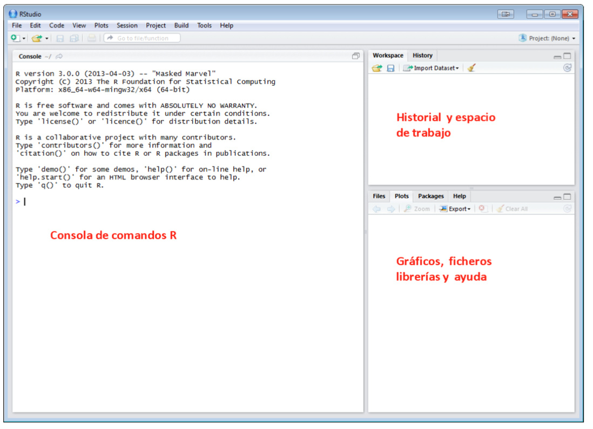

# Introducción a R y Rstudio {#intro}

## Software estadístico R
[R](https://cran.r-project.org) es un programa estadístico _open source_ de gran versatilidad que permite analizar una amplia gama de problemas cuantitativos. Si bien R incorpora un lenguaje de programación que puede ser extremadamente complejo, vale la pena familiarizarse con esa herramienta que puede llegar a ser muy útil en el futuro, tanto dentro como fuera de la academia.  

### Aspectos básicos de R 
 
1. R distingue mayúsculas y minúsculas. 

2. Para asignar contenido a un objeto usamos `<-`. Por ejemplo, `x <- 10` asigna a `x` el valor `10`. En lugar de `<-` también podemos usar `=`. 

3.Para ver el contenido de un objeto simplemente escribimos su nombre. 

4. Para obtener ayuda usamos el comando help. Por ejemplo, `help(mean)` para obtener ayuda sobre el comando mean que calcula la media. 

5. El GUI o interfaz gráfica de R tiene dos partes principales: la consola y el script. 

```{r rmark1, echo=FALSE, out.width='70%', fig.align='center', fig.cap='Consola de R'}
knitr::include_graphics("imagenes/RGui.png")
```

La _**consola**_ es el corazón de R, allí podemos pedirle cosas y es donde se nos entregan los resultados. También nos avisa de posibles errores (generalmente en color rojo). La consola es lo primero que observamos cuando abrimos el programa. Cuando la consola tiene el cursor `>` significa que le podemos dar comandos para ejecutar. Si es que tiene el símbolo `+` quiere decir que nos falta completar el comando anterior. 
 
Un _**script**_ corresponde a una hoja para escribir comandos. Nos sirve para escribir solo los comandos, y cuando seleccionamos y presionamos _<Ctrl + R>_ (juntos) se ejecuta el comando que hemos escrito y los resultados se visualizaran en la consola Dependiendo del sistema operatio utilizado, la combinación podría ser <Ctrl +Enter>.  El script es práctico por que no solo podemos escribir comandos sino también notas personales. Las notas tienen que estar precedidas por el `#`.

## R Studio 

[RStudio](http://www.rstudio.org) es una interfaz que permite acceder de manera sencilla a todas las funciones de R. Para utilizar RStudio se requiere haber instalado R previamente. La instalación de  RStudio  se puede realizar  desde la [página oficial del programa](http://www.rstudio.org).


### Conociendo a Rstudio

Una vez instalados R y RStudio procedemos a ejecutar el programa RStudio desde cualquiera de los iconos que genera y se mostrará la siguiente pantalla: 
 
 
```{r rmark2, echo=FALSE, out.width='70%', fig.align='center', fig.cap='Pantalla principal Rstudio'}

```


Esta pantalla está dividida en tres partes: 
 
1. La ventana de la izquierda donde está el prompt `>` , llamada Consola, es el espacio de trabajo. 
 
2. La ventana de la derecha se divide en dos: 
* En la ventana superior derecha se encuentra el historial de objetos almacenados en memoria. Desde esta ventana también podemos:            
a) Limpiar nuestro historial             
b) Importar datos             
c) Muestra los comandos y funciones implementadas de los informes con los que se han trabajado. 
 
3. En la ventana inferior de la derecha RStudio muestra el directorio de trabajo, los gráficos que se van generando, paquetes para cargarlos e instalarlos directamente, ayuda y un visor HTML. Estas pestañas se irán describiendo a lo largo del documento


