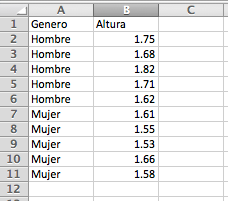
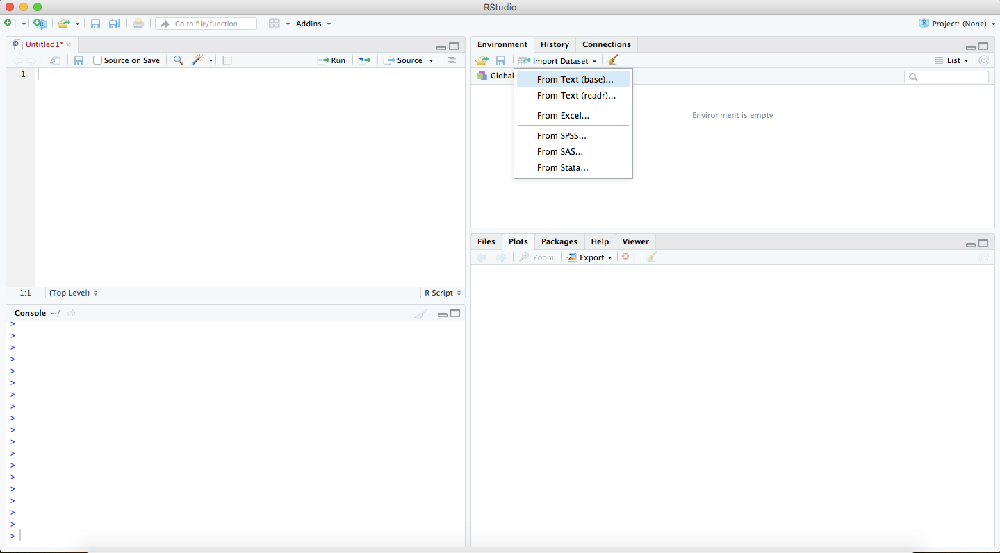
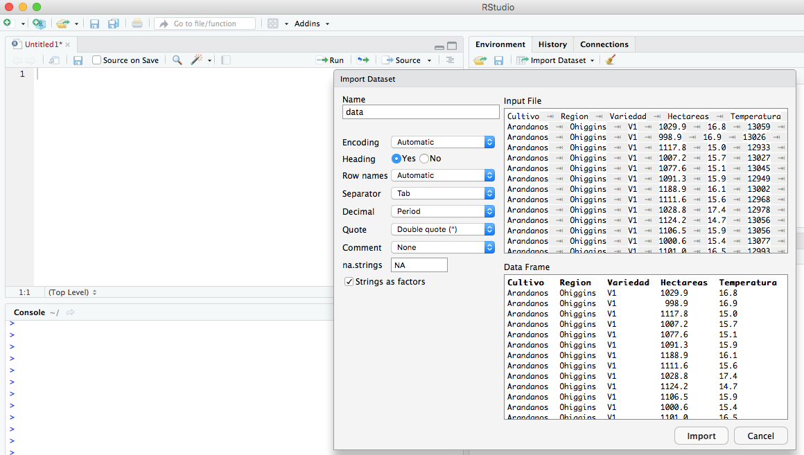
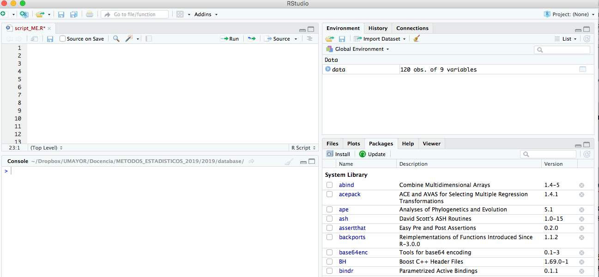
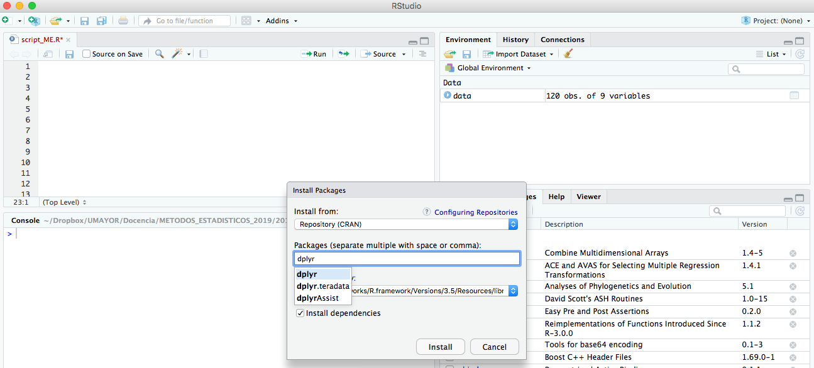

# Lectura y manipulación de datos en RStudio

Hoy en día la información generada a partir del mundo natural se multiplica minuto a minuto. Desde un punto de vista académico y/o profesional, la correcta toma de decisiones demandará la recolección y manejo de grandes cantidades de datos, los cuales nos permitirán describir y determinar propiedades del mundo natural.

Una base de datos se puede definir como un conjunto de información perteneciente a un mismo contexto y almacenada sistemáticamente para su posterior uso. Cada base de datos se compone de una tablas que guarda un conjunto de datos. Cada tabla tiene una o más columnas y filas.

En este laboratorio comenzaremos a trabajar con bases de datos. Para ello abordaremos cuatro tópicos centrales:

1. La preparación de los datos para poder trabajarlos en R,
2. La importación de una base de datos a R,
3. La edición de los datos contenidos en la base de datos,
4. La exploración de la información contenida en nuestra base de datos.


## Preparemos los datos para R
Al mencionar que trabajaremos con base de datos, inmediatamente surge el desafío de como podemos ingresar nuestra información a R. Lo primero que debemos tener presente es que a R "le encantan" las bases de datos que tienen cada observación en una fila y que en cada columna incorpora una variable. Por ejemplo, si tenemos una base de datos con la altura y género de los alumnos del curso “métodos estadísticos” de la escuela de Agronomía, esta se vería de la siguiente manera en excel:

<div class="figure" style="text-align: center">

<p class="caption">(\#fig:rmark4)Ejemplo de base de datos en excel</p>
</div>

Si creáramaos esta misma base de datos en Rstudio deberíamos hacer lo siguiente:


```r
genero <- c("Hombre","Hombre","Hombre","Hombre","Hombre","Mujer","Mujer","Mujer","Mujer","Mujer")
altura<-c(1.75,1.68,1.82,1.71,1.62,1.61,1.55,1.53,1.66,1.58)
base_de_datos <- data.frame(genero,altura)
```

¿Cuáles son las dimensiones de esta base de datos?. La tabla tiene una dimensión de 10x2. Esto quiere decir que está compuesta de diez filas y dos columnas.

**IMPORTANTE:**

* Las filas contienen nuestras observaciones.

* Las columnas contienen nuestras variables.

* R reconoce puntos (".") y no comas (",") como separador de decimales.
 
* Revisar que nuestra base de datos no contenga filas en blanco (sin valores). Cuando eso ocurra se recomienda rellenar el espacio con las letras `NA` ("Not available").

### ¿Qué formato de archivos reconoce R?

R es muy versátil para reconocer y leer múltiples formatos de archivo. Los archivos de texto plano, tales
como TXT o CSV, son la opción más sencilla para importar datos desde hojas de cálculo. Por ejemplo, Excel
permite guardar archivos .txt (texto delimitado por tabulaciones) o .csv (texto delimitados por comas). En
este curso los alentamos a utilizar el formato CSV. Una ventaja de este tipo de representación es que los
datos se pueden visualizar/editar con un editor de texto. CSV representa la información en forma de tabla
donde las columnas se delimitan con un carácter (por defecto, con coma)* y las filas con saltos de línea.

## Importemos los datos a R

Para importar los datos, necesitamos especificar a R la localización (ruta) de los datos en el computador. El
problema es que la ruta de los archivos generalmente son muy largas y difícil de memorizar. Además, si se
equivocan al escribirla, R no la reconocerá. Es por ello que es preferible que RStudio haga ese difícil trabajo.

A lo largo de nuestro curso, el método que utilizaremos para importar la base de datos se basará en la
herramienta Import dataset. Rstudio proporciona una función de importación a través de la pestaña Import
dataset en la parte superior derecha.

<div class="figure" style="text-align: center">

<p class="caption">(\#fig:rmark5)Importación de datos desde Rstudio</p>
</div>

Esta función nos permitirá buscar el archivo de datos, seleccionarlo y finalmente para poder cargar la base de
datos en R. Al seleccionar la opción From Text (base), podemos navegar en nuestro computador para
encontrar nuestro archivo con la base de datos. Una vez lo seleccionamos, solamente debemos hacer clic en
el botón Open para que la magia se haga realidad.

* Para aprender sobre otros métodos de importación de datos les sugerimos visitar el siguiente [link](https://thepracticalr.wordpress.com/2016/09/23/importing-data-into-r/)

Una vez seleccionado el archivo, se abrirá una ventana que entrega una vista preliminar del archivo
seleccionado. En la parte superior izquierda, podrán observar la opción name, la cual nos permite asignar un
nombre a nuestra base de datos (¿Recuerdan el comando `<-`?). En este caso, nuestra base de datos recibirá
el nombre `data`. Lo único que resta por hacer es darle la orden a R para que importe la base de datos. Esto lo
lo podemos hacer habiendo clic en el botón `Import`.

<div class="figure" style="text-align: center">

<p class="caption">(\#fig:rmark6)Paso final para Importación de datos</p>
</div>

La base de datos que trabajaremos a lo largo del curso contiene nueve diferentes variables:

1. **Cultivo**: Proporciona el cultivo sobre el cuales realizaron las observaciones.

2. **Region**: Hace referencia a la división territorial de Chile en donde se realizó el muestreo.

3. **Variedad**: Indica las diferentes variedades del cultivo que fueron estudiadas.

4. **Hectareas**: Proporciona la superficie plantada con el cultivo (hectáreas).

5. **Temperatura**: Indica el valor de temperatura ambiental promedio anual para cada sitio de muestreo.

6. **costo_jh**: Indica el valor pagado por jornada hombre (pesos chilenos).

7. **rendimiento**: Proporciona el rendimiento del cultivo en cada sitio de muestreo (toneladas/hectárea).

8. **Perdida_plaga**: Indica las perdidas en rendimiento causadas por la presencia de insectos plaga (porcentaje).

9. **mano_de_obra**: Proporciona el número de personas contratadas para realizar las labores asociadas a la temporada de cosecha en cada sitio de muestreo.

**Importante:**

* La base de datos acá presentada es una base de datos ficticia creada sólo con fines académicos

## Exploremos los datos a R
Al importar nuestro archivo, lo que buscamos es analizar incluso graficar la información contenida en la
base de datos. Sin embargo, antes de eso existe un paso sensible y crítico que jamás debemos olvidar. Es
importante asegurarnos que importamos correctamente nuestros datos!

La función `str()` nos mostrará el tipo de datos contenido en nuestra base de datos y enumerará cada variable
de columna junto con su tipo de datos.


```
## Warning: package 'readxl' was built under R version 4.0.3
```


```r
str(data)
```

```
## 'data.frame':	120 obs. of  9 variables:
##  $ Cultivo      : chr  "Arandanos" "Arandanos" "Arandanos" "Arandanos" ...
##  $ Region       : chr  "Ohiggins" "Ohiggins" "Ohiggins" "Ohiggins" ...
##  $ Variedad     : chr  "V1" "V1" "V1" "V1" ...
##  $ Hectareas    : num  1030 999 1118 1007 1078 ...
##  $ Temperatura  : num  16.8 16.9 15 15.7 15.1 15.9 16.1 15.6 17.4 14.7 ...
##  $ costo_jh     : int  13059 13026 12933 13027 13045 12949 13002 12968 12978 13056 ...
##  $ rendimiento  : num  6866 7122 7041 6892 6928 ...
##  $ Perdida_plaga: num  35.1 34.3 31.7 40.5 35.6 33 38.1 37.9 34.8 34.4 ...
##  $ mano_de_obra : int  3080 2728 3120 3135 3276 2966 2725 2874 2785 3193 ...
```

Como podemos ver, nuestra base contiene variables con diferentes tipos de datos.

La función `summary()` nos proporciona para cada variable un conjunto de estadísticas descriptivas, según el tipo de variable:


```r
summary(data)
```

```
##    Cultivo             Region            Variedad           Hectareas     
##  Length:120         Length:120         Length:120         Min.   : 998.9  
##  Class :character   Class :character   Class :character   1st Qu.:1477.7  
##  Mode  :character   Mode  :character   Mode  :character   Median :1797.0  
##                                                           Mean   :2090.7  
##                                                           3rd Qu.:2352.7  
##                                                           Max.   :3788.0  
##   Temperatura       costo_jh      rendimiento   Perdida_plaga    mano_de_obra 
##  Min.   :10.00   Min.   :11893   Min.   :4166   Min.   :24.70   Min.   :2609  
##  1st Qu.:12.50   1st Qu.:11997   1st Qu.:4765   1st Qu.:32.95   1st Qu.:3092  
##  Median :13.75   Median :12490   Median :5457   Median :34.60   Median :3312  
##  Mean   :13.74   Mean   :12500   Mean   :5617   Mean   :34.66   Mean   :3384  
##  3rd Qu.:15.10   3rd Qu.:13002   3rd Qu.:6285   3rd Qu.:37.30   3rd Qu.:3645  
##  Max.   :17.40   Max.   :13121   Max.   :7247   Max.   :42.80   Max.   :4274
```


1. **Variables numéricas:** `summary()` proporciona el rango, los cuartiles, la mediana y la media.

2. **Variables factoriales:** `summary()` proporciona una tabla con frecuencias.

3. **Variables numéricas y factoriales:** `summary()`, en caso de que existan, nos entregará información sobre el número de valores faltantes (`NAs`).

4. **Variables de caracteres:** `summary()` solo proporciona la longitud de la variable.

La función `head()` nos entregará las primeras filas de nuestra base de datos. Por defecto serán las primeras 6:


```r
head(data)
```

```
##     Cultivo   Region Variedad Hectareas Temperatura costo_jh rendimiento
## 1 Arandanos Ohiggins       V1    1029.9        16.8    13059      6866.5
## 2 Arandanos Ohiggins       V1     998.9        16.9    13026      7122.1
## 3 Arandanos Ohiggins       V1    1117.8        15.0    12933      7041.2
## 4 Arandanos Ohiggins       V1    1007.2        15.7    13027      6891.5
## 5 Arandanos Ohiggins       V1    1077.6        15.1    13045      6927.7
## 6 Arandanos Ohiggins       V1    1091.3        15.9    12949      6900.4
##   Perdida_plaga mano_de_obra
## 1          35.1         3080
## 2          34.3         2728
## 3          31.7         3120
## 4          40.5         3135
## 5          35.6         3276
## 6          33.0         2966
```

En caso de que quisiéramos ampliar el número de filas:


```r
head(data, 10)
```

```
##      Cultivo   Region Variedad Hectareas Temperatura costo_jh rendimiento
## 1  Arandanos Ohiggins       V1    1029.9        16.8    13059      6866.5
## 2  Arandanos Ohiggins       V1     998.9        16.9    13026      7122.1
## 3  Arandanos Ohiggins       V1    1117.8        15.0    12933      7041.2
## 4  Arandanos Ohiggins       V1    1007.2        15.7    13027      6891.5
## 5  Arandanos Ohiggins       V1    1077.6        15.1    13045      6927.7
## 6  Arandanos Ohiggins       V1    1091.3        15.9    12949      6900.4
## 7  Arandanos Ohiggins       V1    1188.9        16.1    13002      6943.9
## 8  Arandanos Ohiggins       V1    1111.6        15.6    12968      6885.7
## 9  Arandanos Ohiggins       V1    1028.8        17.4    12978      6724.3
## 10 Arandanos Ohiggins       V1    1124.2        14.7    13056      6920.4
##    Perdida_plaga mano_de_obra
## 1           35.1         3080
## 2           34.3         2728
## 3           31.7         3120
## 4           40.5         3135
## 5           35.6         3276
## 6           33.0         2966
## 7           38.1         2725
## 8           37.9         2874
## 9           34.8         2785
## 10          34.4         3193
```

Por otro lado, la función `tail()` nos entregará las últimas filas de nuestra base de datos. Por defecto serán
las últimas 6:


```r
tail(data)
```

```
##       Cultivo       Region Variedad Hectareas Temperatura costo_jh rendimiento
## 115 Arandanos La_Araucania       V2    1857.6        11.1    11974      4591.7
## 116 Arandanos La_Araucania       V2    1862.7        11.6    11960      4689.4
## 117 Arandanos La_Araucania       V2    1894.5        10.6    12023      4400.5
## 118 Arandanos La_Araucania       V2    1873.5        11.1    11971      4380.6
## 119 Arandanos La_Araucania       V2    1915.4        11.5    12065      4424.1
## 120 Arandanos La_Araucania       V2    1932.1        13.5    12084      4331.0
##     Perdida_plaga mano_de_obra
## 115          33.2         3439
## 116          38.1         3566
## 117          24.7         3552
## 118          37.6         3449
## 119          35.1         3550
## 120          38.3         3162
```

La función `names()` nos entregará el nombre de las variables (columnas) contenidas en nuestra base de
datos:


```r
names(data)
```

```
## [1] "Cultivo"       "Region"        "Variedad"      "Hectareas"    
## [5] "Temperatura"   "costo_jh"      "rendimiento"   "Perdida_plaga"
## [9] "mano_de_obra"
```

En caso de que quisiéramos conocer las dimensiones (número de columnas y filas) de nuestra base de datos,
podemos utilizar la función `dim()`:


```r
dim(data)
```

```
## [1] 120   9
```

**Tips:**

Mucho de lo anteriormente visto lo podemos transformar en tablas mucho más amigables con la función `ktable` del paquete `knitr`. Por ejemplo la siguiente Tabla se obtuvo mediante el siguiente código:


```r
knitr::kable(
  head(data), 
  caption = "Ejemplo de Tabla de Datos con ktable")
```


Table: (\#tab:unnamed-chunk-10)Ejemplo de Tabla de Datos con ktable

|Cultivo   |Region   |Variedad | Hectareas| Temperatura| costo_jh| rendimiento| Perdida_plaga| mano_de_obra|
|:---------|:--------|:--------|---------:|-----------:|--------:|-----------:|-------------:|------------:|
|Arandanos |Ohiggins |V1       |    1029.9|        16.8|    13059|      6866.5|          35.1|         3080|
|Arandanos |Ohiggins |V1       |     998.9|        16.9|    13026|      7122.1|          34.3|         2728|
|Arandanos |Ohiggins |V1       |    1117.8|        15.0|    12933|      7041.2|          31.7|         3120|
|Arandanos |Ohiggins |V1       |    1007.2|        15.7|    13027|      6891.5|          40.5|         3135|
|Arandanos |Ohiggins |V1       |    1077.6|        15.1|    13045|      6927.7|          35.6|         3276|
|Arandanos |Ohiggins |V1       |    1091.3|        15.9|    12949|      6900.4|          33.0|         2966|


## Exploremos los datos R con la libreria dplyr

Una de las grandes ventajas de R es la ampliación de sus funcionalidades básicas mediante paquetes
(packages) o librerías. Las librerías de R se pueden instalar de múltiples formas. En RStudio, lo haremos de
siguiendo una serie de sencillos pasos.

Debemos hacer clic en la pestaña package ubicada en el panel inferior derecho. Al hacer clic en esta pestaña,
aparecerá una pequeña ventana con tres campos principales: Install from, packages, and Install to Library.
Solo necesitamos preocuparnos por el campo packages, los otros dos los dejaremos en su valor
predeterminado.

<div class="figure" style="text-align: center">

<p class="caption">(\#fig:rmark7)Instalación de paquete dplyr</p>
</div>


Ahora, al escribir las primeras letras del nombre de una librería (en este caso `dplyr`), Rstudio proporcionará
una lista de librerías disponibles que coincidan con esta palabra. Después de encontrar la librería, todo lo
que tenemos que hacer es hacer clic en el botón Install y dejar que Rstudio trabaje.

<div class="figure" style="text-align: center">

<p class="caption">(\#fig:rmark8)Instalación de paquete dplyr (2do paso)</p>
</div>


A pesar de estar instalada, a menos que lo especifiquemos, R no cargará la librería en la consola. Entonces,
debemos "llamar" a la librería que acabamos de instalar con el comando `library(dplyr)`.


```r
library(dplyr)
```

```
## Warning: package 'dplyr' was built under R version 4.0.3
```


La librería dplyr incluye un conjunto de comandos que coinciden con las acciones más comunes que se
realizan sobre un conjunto de datos (seleccionar filas `filter`, seleccionar columnas `select`, resumir mediante
alguna medida numérica `summarise`, entre muchas otras). Para mayor información sobre la librería dplyr
puedes acceder al siguiente [link](https://rpubs.com/joser/dplyr).

La función `select()` selecciona columnas de nuestra base:

Intentemos seleccionar la columna Region en la base de datos llamada data


```r
select(data, Region)
```

```
##           Region
## 1       Ohiggins
## 2       Ohiggins
## 3       Ohiggins
## 4       Ohiggins
## 5       Ohiggins
## 6       Ohiggins
## 7       Ohiggins
## 8       Ohiggins
## 9       Ohiggins
## 10      Ohiggins
## 11      Ohiggins
## 12      Ohiggins
## 13      Ohiggins
## 14      Ohiggins
## 15      Ohiggins
## 16      Ohiggins
## 17      Ohiggins
## 18      Ohiggins
## 19      Ohiggins
## 20      Ohiggins
## 21      Ohiggins
## 22      Ohiggins
## 23      Ohiggins
## 24      Ohiggins
## 25      Ohiggins
## 26      Ohiggins
## 27      Ohiggins
## 28      Ohiggins
## 29      Ohiggins
## 30      Ohiggins
## 31         Maule
## 32         Maule
## 33         Maule
## 34         Maule
## 35         Maule
## 36         Maule
## 37         Maule
## 38         Maule
## 39         Maule
## 40         Maule
## 41         Maule
## 42         Maule
## 43         Maule
## 44         Maule
## 45         Maule
## 46         Maule
## 47         Maule
## 48         Maule
## 49         Maule
## 50         Maule
## 51         Maule
## 52         Maule
## 53         Maule
## 54         Maule
## 55         Maule
## 56         Maule
## 57         Maule
## 58         Maule
## 59         Maule
## 60         Maule
## 61        BioBio
## 62        BioBio
## 63        BioBio
## 64        BioBio
## 65        BioBio
## 66        BioBio
## 67        BioBio
## 68        BioBio
## 69        BioBio
## 70        BioBio
## 71        BioBio
## 72        BioBio
## 73        BioBio
## 74        BioBio
## 75        BioBio
## 76        BioBio
## 77        BioBio
## 78        BioBio
## 79        BioBio
## 80        BioBio
## 81        BioBio
## 82        BioBio
## 83        BioBio
## 84        BioBio
## 85        BioBio
## 86        BioBio
## 87        BioBio
## 88        BioBio
## 89        BioBio
## 90        BioBio
## 91  La_Araucania
## 92  La_Araucania
## 93  La_Araucania
## 94  La_Araucania
## 95  La_Araucania
## 96  La_Araucania
## 97  La_Araucania
## 98  La_Araucania
## 99  La_Araucania
## 100 La_Araucania
## 101 La_Araucania
## 102 La_Araucania
## 103 La_Araucania
## 104 La_Araucania
## 105 La_Araucania
## 106 La_Araucania
## 107 La_Araucania
## 108 La_Araucania
## 109 La_Araucania
## 110 La_Araucania
## 111 La_Araucania
## 112 La_Araucania
## 113 La_Araucania
## 114 La_Araucania
## 115 La_Araucania
## 116 La_Araucania
## 117 La_Araucania
## 118 La_Araucania
## 119 La_Araucania
## 120 La_Araucania
```

La función `select()` también nos permite seleccionar todas las columnas excepto una:


```r
select(data, -Region)
```

```
##       Cultivo Variedad Hectareas Temperatura costo_jh rendimiento Perdida_plaga
## 1   Arandanos       V1    1029.9        16.8    13059      6866.5          35.1
## 2   Arandanos       V1     998.9        16.9    13026      7122.1          34.3
## 3   Arandanos       V1    1117.8        15.0    12933      7041.2          31.7
## 4   Arandanos       V1    1007.2        15.7    13027      6891.5          40.5
## 5   Arandanos       V1    1077.6        15.1    13045      6927.7          35.6
## 6   Arandanos       V1    1091.3        15.9    12949      6900.4          33.0
## 7   Arandanos       V1    1188.9        16.1    13002      6943.9          38.1
## 8   Arandanos       V1    1111.6        15.6    12968      6885.7          37.9
## 9   Arandanos       V1    1028.8        17.4    12978      6724.3          34.8
## 10  Arandanos       V1    1124.2        14.7    13056      6920.4          34.4
## 11  Arandanos       V1    1106.5        15.9    13056      7056.9          37.9
## 12  Arandanos       V1    1000.6        15.4    13077      6898.6          30.0
## 13  Arandanos       V1    1101.0        16.5    12993      6797.2          37.3
## 14  Arandanos       V1    1113.9        14.0    12975      6858.2          33.9
## 15  Arandanos       V1    1159.9        14.7    13003      7064.3          31.0
## 16  Arandanos       V2    1110.8        14.3    12970      7028.4          33.0
## 17  Arandanos       V2    1091.4        13.7    13003      7127.7          36.4
## 18  Arandanos       V2    1173.8        15.7    12994      7247.3          33.9
## 19  Arandanos       V2    1034.9        15.1    13033      6896.8          27.2
## 20  Arandanos       V2    1081.7        14.3    13107      6927.3          37.9
## 21  Arandanos       V2    1120.4        14.8    13013      6893.3          41.8
## 22  Arandanos       V2    1054.0        16.9    12998      6929.0          36.9
## 23  Arandanos       V2    1099.7        15.0    12895      7237.8          36.0
## 24  Arandanos       V2    1083.0        15.2    12991      6964.5          34.6
## 25  Arandanos       V2    1063.7        15.3    12969      6776.9          29.5
## 26  Arandanos       V2    1097.1        13.5    13055      7017.3          29.9
## 27  Arandanos       V2    1132.5        14.9    13005      7080.4          34.7
## 28  Arandanos       V2    1086.0        14.4    12988      7171.5          38.2
## 29  Arandanos       V2    1035.5        12.5    12920      7246.0          28.3
## 30  Arandanos       V2    1110.5        16.4    12936      6928.1          32.6
## 31  Arandanos       V1    3750.2        15.6    12968      5931.1          27.5
## 32  Arandanos       V1    3668.7        11.6    13013      6076.3          34.5
## 33  Arandanos       V1    3586.2        15.8    13007      6005.6          38.0
## 34  Arandanos       V1    3678.0        15.0    13033      5964.3          36.9
## 35  Arandanos       V1    3729.1        12.5    13057      6003.4          33.2
## 36  Arandanos       V1    3709.2        15.9    13039      6026.0          36.1
## 37  Arandanos       V1    3636.3        15.6    12961      5973.5          37.7
## 38  Arandanos       V1    3749.6        13.7    13023      6046.6          36.4
## 39  Arandanos       V1    3644.6        12.5    12985      5960.2          34.3
## 40  Arandanos       V1    3634.6        14.5    13041      6011.1          35.6
## 41  Arandanos       V1    3649.5        15.1    12942      6012.2          38.5
## 42  Arandanos       V1    3788.0        13.7    13121      6100.5          29.2
## 43  Arandanos       V1    3699.9        15.9    12945      5932.6          36.9
## 44  Arandanos       V1    3718.2        14.0    12967      5876.5          31.5
## 45  Arandanos       V1    3645.8        13.2    13098      5745.2          38.5
## 46  Arandanos       V2    3699.5        14.0    13065      5890.1          35.5
## 47  Arandanos       V2    3627.4        13.5    13008      6078.3          34.2
## 48  Arandanos       V2    3685.2        16.8    13088      6062.3          38.1
## 49  Arandanos       V2    3770.5        14.5    13034      5852.9          33.5
## 50  Arandanos       V2    3711.1        15.5    13064      6016.7          32.1
## 51  Arandanos       V2    3758.2        13.7    12975      6112.8          37.5
## 52  Arandanos       V2    3685.5        12.7    13087      6032.1          33.5
## 53  Arandanos       V2    3619.6        13.5    12902      6139.0          33.3
## 54  Arandanos       V2    3724.8        14.7    12974      6008.3          37.9
## 55  Arandanos       V2    3735.7        13.5    12976      5936.0          40.2
## 56  Arandanos       V2    3672.5        15.1    12937      5929.8          34.2
## 57  Arandanos       V2    3657.3        15.3    12946      6036.1          33.3
## 58  Arandanos       V2    3657.9        13.4    12963      6084.7          37.8
## 59  Arandanos       V2    3721.7        15.8    12955      5848.1          30.7
## 60  Arandanos       V2    3762.6        16.2    13059      6125.2          30.0
## 61  Arandanos       V1    1642.1        13.5    12018      4957.5          33.6
## 62  Arandanos       V1    1823.2        13.6    12051      5025.6          32.8
## 63  Arandanos       V1    1801.9        12.4    12004      5118.6          27.6
## 64  Arandanos       V1    1742.7        12.6    12005      4980.2          36.3
## 65  Arandanos       V1    1731.6        13.8    12069      5024.6          35.7
## 66  Arandanos       V1    1601.4        11.7    11906      5007.0          32.1
## 67  Arandanos       V1    1793.8        13.9    11901      4825.8          34.2
## 68  Arandanos       V1    1766.3        14.1    11962      5164.7          34.2
## 69  Arandanos       V1    1793.7        14.8    11989      4767.4          34.0
## 70  Arandanos       V1    1742.0        11.5    11988      5013.5          33.4
## 71  Arandanos       V1    1656.7        14.0    11976      5013.0          34.6
## 72  Arandanos       V1    1659.9        14.8    12014      5102.8          29.6
## 73  Arandanos       V1    1573.9        14.9    12083      4924.8          35.0
## 74  Arandanos       V1    1781.8        13.4    11997      5061.5          31.4
## 75  Arandanos       V1    1724.4        12.5    11893      4892.4          41.8
## 76  Arandanos       V2    1800.3        13.9    11927      5129.7          37.7
## 77  Arandanos       V2    1683.0        11.9    12046      5115.4          34.6
## 78  Arandanos       V2    1733.9        13.3    11993      4992.5          35.6
## 79  Arandanos       V2    1803.5        13.7    11900      4962.0          39.3
## 80  Arandanos       V2    1679.8        14.8    11987      4905.3          36.7
## 81  Arandanos       V2    1743.7        15.2    12005      5037.2          34.6
## 82  Arandanos       V2    1664.5        14.8    11906      5107.2          31.6
## 83  Arandanos       V2    1715.7        14.5    11962      4914.6          37.1
## 84  Arandanos       V2    1706.4        12.4    11985      5058.8          41.2
## 85  Arandanos       V2    1698.5        12.1    11919      4934.8          37.0
## 86  Arandanos       V2    1734.7        13.8    11997      4965.1          34.6
## 87  Arandanos       V2    1785.3        14.0    11967      4970.2          37.5
## 88  Arandanos       V2    1694.2        15.7    11967      5137.6          33.3
## 89  Arandanos       V2    1680.7        12.1    11938      5140.9          31.7
## 90  Arandanos       V2    1681.4        12.7    11988      5168.7          33.5
## 91  Arandanos       V1    1907.5        11.3    12005      4166.3          33.2
## 92  Arandanos       V1    1896.7        12.4    12015      4439.0          33.6
## 93  Arandanos       V1    1867.3        11.9    12011      4374.1          37.6
## 94  Arandanos       V1    1922.1        13.0    11995      4506.7          37.8
## 95  Arandanos       V1    1941.5        11.2    12018      4466.9          37.1
## 96  Arandanos       V1    1846.2        12.8    12023      4469.6          33.4
## 97  Arandanos       V1    1854.6        11.9    12084      4517.0          31.8
## 98  Arandanos       V1    1898.1        10.0    12069      4538.1          34.9
## 99  Arandanos       V1    1783.3        11.9    11923      4456.1          42.8
## 100 Arandanos       V1    1833.6        13.1    11970      4444.0          35.4
## 101 Arandanos       V1    1801.7        12.8    12007      4525.9          37.4
## 102 Arandanos       V1    1931.0        11.5    12023      4632.6          32.0
## 103 Arandanos       V1    1865.6        13.3    12022      4327.5          31.4
## 104 Arandanos       V1    1819.9        10.3    12063      4526.0          33.6
## 105 Arandanos       V1    1855.1        11.6    12042      4523.7          31.1
## 106 Arandanos       V2    1910.0        12.6    11924      4447.8          32.8
## 107 Arandanos       V2    1708.3        10.4    11962      4421.7          37.6
## 108 Arandanos       V2    1823.3        13.2    11951      4554.1          35.0
## 109 Arandanos       V2    1780.9        11.6    12050      4344.9          37.3
## 110 Arandanos       V2    1886.3        10.1    12020      4456.3          29.8
## 111 Arandanos       V2    1838.7        13.1    11961      4528.3          34.1
## 112 Arandanos       V2    1858.9        10.1    12038      4651.1          30.4
## 113 Arandanos       V2    1761.6        12.0    12037      4758.3          32.8
## 114 Arandanos       V2    1908.1        10.6    12055      4539.7          34.1
## 115 Arandanos       V2    1857.6        11.1    11974      4591.7          33.2
## 116 Arandanos       V2    1862.7        11.6    11960      4689.4          38.1
## 117 Arandanos       V2    1894.5        10.6    12023      4400.5          24.7
## 118 Arandanos       V2    1873.5        11.1    11971      4380.6          37.6
## 119 Arandanos       V2    1915.4        11.5    12065      4424.1          35.1
## 120 Arandanos       V2    1932.1        13.5    12084      4331.0          38.3
##     mano_de_obra
## 1           3080
## 2           2728
## 3           3120
## 4           3135
## 5           3276
## 6           2966
## 7           2725
## 8           2874
## 9           2785
## 10          3193
## 11          2872
## 12          2983
## 13          2932
## 14          2965
## 15          2609
## 16          3104
## 17          2790
## 18          2720
## 19          3099
## 20          2868
## 21          3307
## 22          3155
## 23          3093
## 24          2928
## 25          2996
## 26          3002
## 27          3285
## 28          3068
## 29          3308
## 30          2724
## 31          3446
## 32          3204
## 33          3225
## 34          2979
## 35          3222
## 36          3504
## 37          3349
## 38          3066
## 39          3186
## 40          3205
## 41          3080
## 42          3463
## 43          3410
## 44          2956
## 45          3316
## 46          3027
## 47          2980
## 48          3319
## 49          3640
## 50          2891
## 51          3559
## 52          3278
## 53          3356
## 54          3159
## 55          3363
## 56          3341
## 57          3094
## 58          3480
## 59          3088
## 60          3434
## 61          3914
## 62          3901
## 63          3673
## 64          3953
## 65          4171
## 66          4013
## 67          3864
## 68          3947
## 69          3908
## 70          3764
## 71          4029
## 72          4132
## 73          4030
## 74          3882
## 75          3698
## 76          3880
## 77          3785
## 78          4175
## 79          3660
## 80          3832
## 81          4087
## 82          4101
## 83          4205
## 84          3755
## 85          3889
## 86          4036
## 87          4274
## 88          4101
## 89          4250
## 90          3938
## 91          3198
## 92          3303
## 93          3207
## 94          3484
## 95          3212
## 96          3356
## 97          3408
## 98          3319
## 99          3280
## 100         3105
## 101         3404
## 102         3258
## 103         2927
## 104         3028
## 105         3004
## 106         3403
## 107         3503
## 108         3300
## 109         3325
## 110         3160
## 111         3553
## 112         3614
## 113         3208
## 114         3595
## 115         3439
## 116         3566
## 117         3552
## 118         3449
## 119         3550
## 120         3162
```

La función `slice()` selecciona filas de nuestra base. Intentemos seleccionar la quinta fila en la base de datos llamada data:


```r
slice(data, 5)
```

```
##     Cultivo   Region Variedad Hectareas Temperatura costo_jh rendimiento
## 1 Arandanos Ohiggins       V1    1077.6        15.1    13045      6927.7
##   Perdida_plaga mano_de_obra
## 1          35.6         3276
```

La función `slice()` también nos permite seleccionar una secuencia de filas. Seleccionemos desde la tercera hasta la decima en la base de datos llamada data:


```r
slice(data, 3:10)
```

```
##     Cultivo   Region Variedad Hectareas Temperatura costo_jh rendimiento
## 1 Arandanos Ohiggins       V1    1117.8        15.0    12933      7041.2
## 2 Arandanos Ohiggins       V1    1007.2        15.7    13027      6891.5
## 3 Arandanos Ohiggins       V1    1077.6        15.1    13045      6927.7
## 4 Arandanos Ohiggins       V1    1091.3        15.9    12949      6900.4
## 5 Arandanos Ohiggins       V1    1188.9        16.1    13002      6943.9
## 6 Arandanos Ohiggins       V1    1111.6        15.6    12968      6885.7
## 7 Arandanos Ohiggins       V1    1028.8        17.4    12978      6724.3
## 8 Arandanos Ohiggins       V1    1124.2        14.7    13056      6920.4
##   Perdida_plaga mano_de_obra
## 1          31.7         3120
## 2          40.5         3135
## 3          35.6         3276
## 4          33.0         2966
## 5          38.1         2725
## 6          37.9         2874
## 7          34.8         2785
## 8          34.4         3193
```

La versatilidad de la función `slice()` es aún mayor. Por ejemplo, podemos seleccionar una secuencia de filas
discontinua:


```r
slice(data, c(3,10,25,100))
```

```
##     Cultivo       Region Variedad Hectareas Temperatura costo_jh rendimiento
## 1 Arandanos     Ohiggins       V1    1117.8        15.0    12933      7041.2
## 2 Arandanos     Ohiggins       V1    1124.2        14.7    13056      6920.4
## 3 Arandanos     Ohiggins       V2    1063.7        15.3    12969      6776.9
## 4 Arandanos La_Araucania       V1    1833.6        13.1    11970      4444.0
##   Perdida_plaga mano_de_obra
## 1          31.7         3120
## 2          34.4         3193
## 3          29.5         2996
## 4          35.4         3105
```

También existe la función `filter()``, la cual nos permite seleccionar las observaciones (filas) que cumplen las condiciones que nos interesan. 

En caso de que quisiéramos seleccionar todas aquellas observaciones en donde el rendimiento fue mayor 7000 toneladas/hectárea:


```r
filter(data, rendimiento > 7000)
```

```
##      Cultivo   Region Variedad Hectareas Temperatura costo_jh rendimiento
## 1  Arandanos Ohiggins       V1     998.9        16.9    13026      7122.1
## 2  Arandanos Ohiggins       V1    1117.8        15.0    12933      7041.2
## 3  Arandanos Ohiggins       V1    1106.5        15.9    13056      7056.9
## 4  Arandanos Ohiggins       V1    1159.9        14.7    13003      7064.3
## 5  Arandanos Ohiggins       V2    1110.8        14.3    12970      7028.4
## 6  Arandanos Ohiggins       V2    1091.4        13.7    13003      7127.7
## 7  Arandanos Ohiggins       V2    1173.8        15.7    12994      7247.3
## 8  Arandanos Ohiggins       V2    1099.7        15.0    12895      7237.8
## 9  Arandanos Ohiggins       V2    1097.1        13.5    13055      7017.3
## 10 Arandanos Ohiggins       V2    1132.5        14.9    13005      7080.4
## 11 Arandanos Ohiggins       V2    1086.0        14.4    12988      7171.5
## 12 Arandanos Ohiggins       V2    1035.5        12.5    12920      7246.0
##    Perdida_plaga mano_de_obra
## 1           34.3         2728
## 2           31.7         3120
## 3           37.9         2872
## 4           31.0         2609
## 5           33.0         3104
## 6           36.4         2790
## 7           33.9         2720
## 8           36.0         3093
## 9           29.9         3002
## 10          34.7         3285
## 11          38.2         3068
## 12          28.3         3308
```

Si estuviésemos interesados en seleccionar aquellas observaciones en donde el rendimiento fue mayor 7000
toneladas/hectárea solamente para la variedad 1 de arándanos:


```r
filter(data, rendimiento > 7000, Variedad == "V1")
```

```
##     Cultivo   Region Variedad Hectareas Temperatura costo_jh rendimiento
## 1 Arandanos Ohiggins       V1     998.9        16.9    13026      7122.1
## 2 Arandanos Ohiggins       V1    1117.8        15.0    12933      7041.2
## 3 Arandanos Ohiggins       V1    1106.5        15.9    13056      7056.9
## 4 Arandanos Ohiggins       V1    1159.9        14.7    13003      7064.3
##   Perdida_plaga mano_de_obra
## 1          34.3         2728
## 2          31.7         3120
## 3          37.9         2872
## 4          31.0         2609
```

Ahora, intentemos seleccionar aquellas observaciones en donde el rendimiento fue mayor 7000 toneladas/hectárea "o" que sean de la Variedad 1:


```r
filter(data, rendimiento > 7000 | Variedad == "V1")
```

```
##      Cultivo       Region Variedad Hectareas Temperatura costo_jh rendimiento
## 1  Arandanos     Ohiggins       V1    1029.9        16.8    13059      6866.5
## 2  Arandanos     Ohiggins       V1     998.9        16.9    13026      7122.1
## 3  Arandanos     Ohiggins       V1    1117.8        15.0    12933      7041.2
## 4  Arandanos     Ohiggins       V1    1007.2        15.7    13027      6891.5
## 5  Arandanos     Ohiggins       V1    1077.6        15.1    13045      6927.7
## 6  Arandanos     Ohiggins       V1    1091.3        15.9    12949      6900.4
## 7  Arandanos     Ohiggins       V1    1188.9        16.1    13002      6943.9
## 8  Arandanos     Ohiggins       V1    1111.6        15.6    12968      6885.7
## 9  Arandanos     Ohiggins       V1    1028.8        17.4    12978      6724.3
## 10 Arandanos     Ohiggins       V1    1124.2        14.7    13056      6920.4
## 11 Arandanos     Ohiggins       V1    1106.5        15.9    13056      7056.9
## 12 Arandanos     Ohiggins       V1    1000.6        15.4    13077      6898.6
## 13 Arandanos     Ohiggins       V1    1101.0        16.5    12993      6797.2
## 14 Arandanos     Ohiggins       V1    1113.9        14.0    12975      6858.2
## 15 Arandanos     Ohiggins       V1    1159.9        14.7    13003      7064.3
## 16 Arandanos     Ohiggins       V2    1110.8        14.3    12970      7028.4
## 17 Arandanos     Ohiggins       V2    1091.4        13.7    13003      7127.7
## 18 Arandanos     Ohiggins       V2    1173.8        15.7    12994      7247.3
## 19 Arandanos     Ohiggins       V2    1099.7        15.0    12895      7237.8
## 20 Arandanos     Ohiggins       V2    1097.1        13.5    13055      7017.3
## 21 Arandanos     Ohiggins       V2    1132.5        14.9    13005      7080.4
## 22 Arandanos     Ohiggins       V2    1086.0        14.4    12988      7171.5
## 23 Arandanos     Ohiggins       V2    1035.5        12.5    12920      7246.0
## 24 Arandanos        Maule       V1    3750.2        15.6    12968      5931.1
## 25 Arandanos        Maule       V1    3668.7        11.6    13013      6076.3
## 26 Arandanos        Maule       V1    3586.2        15.8    13007      6005.6
## 27 Arandanos        Maule       V1    3678.0        15.0    13033      5964.3
## 28 Arandanos        Maule       V1    3729.1        12.5    13057      6003.4
## 29 Arandanos        Maule       V1    3709.2        15.9    13039      6026.0
## 30 Arandanos        Maule       V1    3636.3        15.6    12961      5973.5
## 31 Arandanos        Maule       V1    3749.6        13.7    13023      6046.6
## 32 Arandanos        Maule       V1    3644.6        12.5    12985      5960.2
## 33 Arandanos        Maule       V1    3634.6        14.5    13041      6011.1
## 34 Arandanos        Maule       V1    3649.5        15.1    12942      6012.2
## 35 Arandanos        Maule       V1    3788.0        13.7    13121      6100.5
## 36 Arandanos        Maule       V1    3699.9        15.9    12945      5932.6
## 37 Arandanos        Maule       V1    3718.2        14.0    12967      5876.5
## 38 Arandanos        Maule       V1    3645.8        13.2    13098      5745.2
## 39 Arandanos       BioBio       V1    1642.1        13.5    12018      4957.5
## 40 Arandanos       BioBio       V1    1823.2        13.6    12051      5025.6
## 41 Arandanos       BioBio       V1    1801.9        12.4    12004      5118.6
## 42 Arandanos       BioBio       V1    1742.7        12.6    12005      4980.2
## 43 Arandanos       BioBio       V1    1731.6        13.8    12069      5024.6
## 44 Arandanos       BioBio       V1    1601.4        11.7    11906      5007.0
## 45 Arandanos       BioBio       V1    1793.8        13.9    11901      4825.8
## 46 Arandanos       BioBio       V1    1766.3        14.1    11962      5164.7
## 47 Arandanos       BioBio       V1    1793.7        14.8    11989      4767.4
## 48 Arandanos       BioBio       V1    1742.0        11.5    11988      5013.5
## 49 Arandanos       BioBio       V1    1656.7        14.0    11976      5013.0
## 50 Arandanos       BioBio       V1    1659.9        14.8    12014      5102.8
## 51 Arandanos       BioBio       V1    1573.9        14.9    12083      4924.8
## 52 Arandanos       BioBio       V1    1781.8        13.4    11997      5061.5
## 53 Arandanos       BioBio       V1    1724.4        12.5    11893      4892.4
## 54 Arandanos La_Araucania       V1    1907.5        11.3    12005      4166.3
## 55 Arandanos La_Araucania       V1    1896.7        12.4    12015      4439.0
## 56 Arandanos La_Araucania       V1    1867.3        11.9    12011      4374.1
## 57 Arandanos La_Araucania       V1    1922.1        13.0    11995      4506.7
## 58 Arandanos La_Araucania       V1    1941.5        11.2    12018      4466.9
## 59 Arandanos La_Araucania       V1    1846.2        12.8    12023      4469.6
## 60 Arandanos La_Araucania       V1    1854.6        11.9    12084      4517.0
## 61 Arandanos La_Araucania       V1    1898.1        10.0    12069      4538.1
## 62 Arandanos La_Araucania       V1    1783.3        11.9    11923      4456.1
## 63 Arandanos La_Araucania       V1    1833.6        13.1    11970      4444.0
## 64 Arandanos La_Araucania       V1    1801.7        12.8    12007      4525.9
## 65 Arandanos La_Araucania       V1    1931.0        11.5    12023      4632.6
## 66 Arandanos La_Araucania       V1    1865.6        13.3    12022      4327.5
## 67 Arandanos La_Araucania       V1    1819.9        10.3    12063      4526.0
## 68 Arandanos La_Araucania       V1    1855.1        11.6    12042      4523.7
##    Perdida_plaga mano_de_obra
## 1           35.1         3080
## 2           34.3         2728
## 3           31.7         3120
## 4           40.5         3135
## 5           35.6         3276
## 6           33.0         2966
## 7           38.1         2725
## 8           37.9         2874
## 9           34.8         2785
## 10          34.4         3193
## 11          37.9         2872
## 12          30.0         2983
## 13          37.3         2932
## 14          33.9         2965
## 15          31.0         2609
## 16          33.0         3104
## 17          36.4         2790
## 18          33.9         2720
## 19          36.0         3093
## 20          29.9         3002
## 21          34.7         3285
## 22          38.2         3068
## 23          28.3         3308
## 24          27.5         3446
## 25          34.5         3204
## 26          38.0         3225
## 27          36.9         2979
## 28          33.2         3222
## 29          36.1         3504
## 30          37.7         3349
## 31          36.4         3066
## 32          34.3         3186
## 33          35.6         3205
## 34          38.5         3080
## 35          29.2         3463
## 36          36.9         3410
## 37          31.5         2956
## 38          38.5         3316
## 39          33.6         3914
## 40          32.8         3901
## 41          27.6         3673
## 42          36.3         3953
## 43          35.7         4171
## 44          32.1         4013
## 45          34.2         3864
## 46          34.2         3947
## 47          34.0         3908
## 48          33.4         3764
## 49          34.6         4029
## 50          29.6         4132
## 51          35.0         4030
## 52          31.4         3882
## 53          41.8         3698
## 54          33.2         3198
## 55          33.6         3303
## 56          37.6         3207
## 57          37.8         3484
## 58          37.1         3212
## 59          33.4         3356
## 60          31.8         3408
## 61          34.9         3319
## 62          42.8         3280
## 63          35.4         3105
## 64          37.4         3404
## 65          32.0         3258
## 66          31.4         2927
## 67          33.6         3028
## 68          31.1         3004
```

## Reducción de una base de datos

La importancia de estas funciones radica en que nos permiten trabajar con subconjuntos de la base de datos
original. Por ejemplo, podemos generar una nueva base de datos que solo contenga la información referida a
las plantaciones de arándanos provenientes de la región del Maule:


```r
data1 <- filter(data, Region == "Maule")
data1
```

```
##      Cultivo Region Variedad Hectareas Temperatura costo_jh rendimiento
## 1  Arandanos  Maule       V1    3750.2        15.6    12968      5931.1
## 2  Arandanos  Maule       V1    3668.7        11.6    13013      6076.3
## 3  Arandanos  Maule       V1    3586.2        15.8    13007      6005.6
## 4  Arandanos  Maule       V1    3678.0        15.0    13033      5964.3
## 5  Arandanos  Maule       V1    3729.1        12.5    13057      6003.4
## 6  Arandanos  Maule       V1    3709.2        15.9    13039      6026.0
## 7  Arandanos  Maule       V1    3636.3        15.6    12961      5973.5
## 8  Arandanos  Maule       V1    3749.6        13.7    13023      6046.6
## 9  Arandanos  Maule       V1    3644.6        12.5    12985      5960.2
## 10 Arandanos  Maule       V1    3634.6        14.5    13041      6011.1
## 11 Arandanos  Maule       V1    3649.5        15.1    12942      6012.2
## 12 Arandanos  Maule       V1    3788.0        13.7    13121      6100.5
## 13 Arandanos  Maule       V1    3699.9        15.9    12945      5932.6
## 14 Arandanos  Maule       V1    3718.2        14.0    12967      5876.5
## 15 Arandanos  Maule       V1    3645.8        13.2    13098      5745.2
## 16 Arandanos  Maule       V2    3699.5        14.0    13065      5890.1
## 17 Arandanos  Maule       V2    3627.4        13.5    13008      6078.3
## 18 Arandanos  Maule       V2    3685.2        16.8    13088      6062.3
## 19 Arandanos  Maule       V2    3770.5        14.5    13034      5852.9
## 20 Arandanos  Maule       V2    3711.1        15.5    13064      6016.7
## 21 Arandanos  Maule       V2    3758.2        13.7    12975      6112.8
## 22 Arandanos  Maule       V2    3685.5        12.7    13087      6032.1
## 23 Arandanos  Maule       V2    3619.6        13.5    12902      6139.0
## 24 Arandanos  Maule       V2    3724.8        14.7    12974      6008.3
## 25 Arandanos  Maule       V2    3735.7        13.5    12976      5936.0
## 26 Arandanos  Maule       V2    3672.5        15.1    12937      5929.8
## 27 Arandanos  Maule       V2    3657.3        15.3    12946      6036.1
## 28 Arandanos  Maule       V2    3657.9        13.4    12963      6084.7
## 29 Arandanos  Maule       V2    3721.7        15.8    12955      5848.1
## 30 Arandanos  Maule       V2    3762.6        16.2    13059      6125.2
##    Perdida_plaga mano_de_obra
## 1           27.5         3446
## 2           34.5         3204
## 3           38.0         3225
## 4           36.9         2979
## 5           33.2         3222
## 6           36.1         3504
## 7           37.7         3349
## 8           36.4         3066
## 9           34.3         3186
## 10          35.6         3205
## 11          38.5         3080
## 12          29.2         3463
## 13          36.9         3410
## 14          31.5         2956
## 15          38.5         3316
## 16          35.5         3027
## 17          34.2         2980
## 18          38.1         3319
## 19          33.5         3640
## 20          32.1         2891
## 21          37.5         3559
## 22          33.5         3278
## 23          33.3         3356
## 24          37.9         3159
## 25          40.2         3363
## 26          34.2         3341
## 27          33.3         3094
## 28          37.8         3480
## 29          30.7         3088
## 30          30.0         3434
```

Ahora, podemos aplicar todas las funciones que hemos aprendido para explorar la información contenida en
una base de datos.

