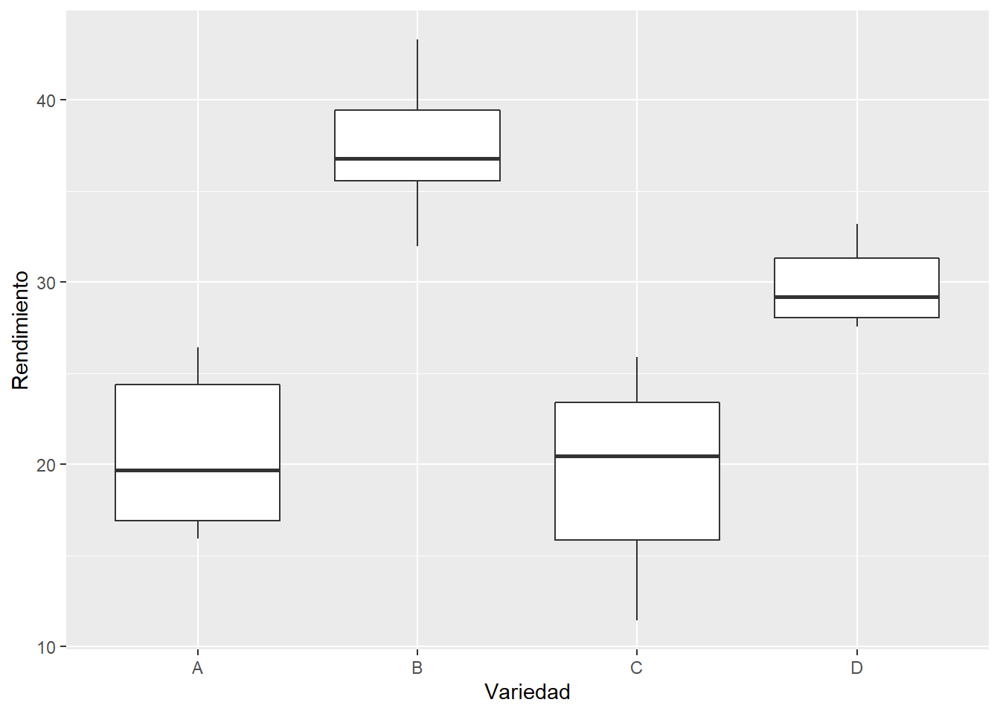
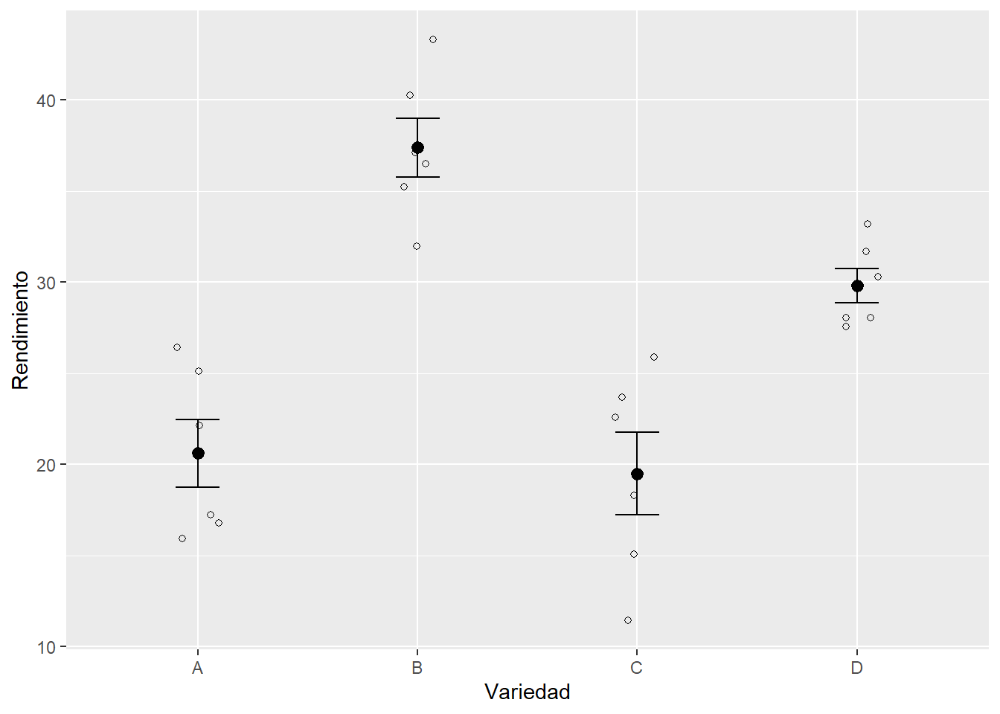

# Análisis de varianza (ANOVA)

## ANOVA de 1 Vía

El análisis de varianza de una vía es un análisis similar a la regresión lineal, pero presenta un cambio en las variables incluidas en el modelo: la variable predictora es una variable categórica (también llamada factor). Es importante considerar que el ANOVA de una vía es una extensión de la prueba t de dos muestras para comparar medias en una situación en la que hay más de dos grupos.

La ecuación matemática general para el ANOVA de una vía es:

$$
Y=\mu + X_1 + \epsilon
$$
donde,
* $Y$ es la variable respuesta.
•	$μ$ es la gran media.
•	$X_1$ es la variable predictora categórica o factor.

En este análisis la hipótesis nula ($H_0$) es la igualdad en todas las medias de los grupos, mientras que la hipótesis alternativa ($H_a$) será la diferencia en al menos una de las medias.

La pregunta que estamos respondiendo con ANOVA es: ¿la variación observada en las medias de los grupos se debe a diferencias en las medias de las poblaciones o simplemente debido a la variabilidad de muestreo? Para responder a esta pregunta, ANOVA calcula un parámetro llamado **estadístico `F`**, que compara la variación entre las medias de los grupos y la variación dentro de los grupos:

$$
F = \frac{\text{variación entre grupos}}{\text{variación dentro de los grupos}} 
$$

A través del estadístico F podemos ver si la variación entre los grupos domina sobre la variación dentro de los grupos, o no. En el primer caso tendremos evidencia sólida para rechazar la hipótesis nula (las medias de todos los grupos no son iguales), mientras que en el segundo caso tendríamos poca evidencia para rechazar la hipótesis nula.

El ANOVA se basa en los siguientes supuestos:

* **Distribución normal** de la población de la que se extraen las muestras.
* **Independencia** de las muestras.
* **Homogeneidad de la varianza** de la población.

## Ejemplo

### Los datos
Para ilustrar el uso del análisis de Varianza (ANOVA) de una vía consideren el siguiente ejemplo: En un experimento para comparar variedades de melón, se cultivaron seis parcelas, cada una con cuatro variedades distintas, las parcelas se asignaron a las variedades de manera completamente aleatoria, y los resultados se dan a continuación:


```r
# Datos extraidos de Mead et al. (1993). Statistical Methods in Agriculture and Experimental Biology
melon <- read.csv2("./datos/datos_melon.csv")

melon
```

```
##    Variedad Rendimiento
## 1         A       25.12
## 2         A       17.25
## 3         A       26.42
## 4         A       16.80
## 5         A       22.15
## 6         A       15.92
## 7         B       40.25
## 8         B       35.26
## 9         B       31.98
## 10        B       36.52
## 11        B       43.32
## 12        B       37.10
## 13        C       18.30
## 14        C       22.60
## 15        C       25.90
## 16        C       15.05
## 17        C       11.42
## 18        C       23.68
## 19        D       28.05
## 20        D       28.05
## 21        D       33.20
## 22        D       31.68
## 23        D       30.32
## 24        D       27.58
```

### Paso 1: Analicemos nuestros datos
Veamos un resumen de nuestros datos 


```r
library(tidyverse)
```

```
## -- Attaching packages ----------------------------- tidyverse 1.2.1 --
```

```
## v ggplot2 3.3.1     v purrr   0.3.4
## v tibble  2.1.3     v dplyr   0.8.3
## v tidyr   1.1.0     v stringr 1.4.0
## v readr   1.3.1     v forcats 0.4.0
```

```
## Warning: package 'ggplot2' was built under R version 3.6.3
```

```
## Warning: package 'tidyr' was built under R version 3.6.3
```

```
## Warning: package 'purrr' was built under R version 3.6.3
```

```
## -- Conflicts -------------------------------- tidyverse_conflicts() --
## x dplyr::filter() masks stats::filter()
## x dplyr::lag()    masks stats::lag()
```

```r
tabla <- melon %>% 
  group_by(Variedad) %>% 
  summarise(rendimiento_promedio = mean(Rendimiento))

tabla
```

```
## # A tibble: 4 x 2
##   Variedad rendimiento_promedio
##   <fct>                   <dbl>
## 1 A                        20.6
## 2 B                        37.4
## 3 C                        19.5
## 4 D                        29.8
```

La tabla nos sugiere que las medias entre las diferentes variedades son distintas

Ahora visualicemos nuestros datos


```r
#Opcion 1
plot_1 <- ggplot(melon, aes(x=Variedad, y=Rendimiento)) +
  geom_boxplot()

plot_1
```



```r
#Opcion 2
plot_2 <- ggplot(melon, aes(x = Variedad, y = Rendimiento)) +
  geom_point(cex = 1.5, pch = 1.0,position = position_jitter(w = 0.1, h = 0)) + 
  stat_summary(fun.data = 'mean_se', geom = 'errorbar', width = 0.2) +
  stat_summary(fun.data = 'mean_se', geom = 'pointrange') +
  geom_point(data=tabla, aes(x=Variedad, y=rendimiento_promedio))

plot_2
```



El gráfico de cajas nos sugiere que las medianas son diferentes entre las Variedades.

### Paso 2: Expresar la hipótesis de investigación 

Ahora realicemos una prueba de hipótesis. Queremos saber si los rendimientos son significativamente diferentes entre las diferentes variedades de melón. ¿Cómo escribiríamos nuestras hipótesis?

$$
H_0: \mu_A = \mu_B = \mu_C = \mu_D  \\
H_a: \mu_A \neq \mu_B \neq \mu_C \neq \mu_D 
$$


### Paso 3: Análisis de Varianza (ANOVA de una vía)

Ahora analicemos nuestros datos a través del análisis de varianza 


```r
res_anova <- aov(melon$Rendimiento ~ melon$Variedad) 
res_anova
```

```
## Call:
##    aov(formula = melon$Rendimiento ~ melon$Variedad)
## 
## Terms:
##                 melon$Variedad Residuals
## Sum of Squares       1279.6226  363.2468
## Deg. of Freedom              3        20
## 
## Residual standard error: 4.26173
## Estimated effects may be unbalanced
```

En el resultado anterior podemos ver el resumen  de la tabla de ANOVA, la cual incluye:
* Suma de cuadrados
* Grados de libertad
* Error residual

### Paso 4: Evaluar los supuestos del modelo. 

Hasta ahora hemos visto diversas formas de evaluar los supuestos asociados a los modelos lineales generales, ya sea con prueba de hipótesis y/o gráficos. ¿Cuál de estas alternativas utilizarás? Ya es hora de empezar a aplicar lo aprendido, no?. 

### Paso 5: Interpretar los resultados del modelo
Usando la función summary () obtenemos toda la información sobre nuestro modelo: 


```r
summary(res_anova)
```

```
##                Df Sum Sq Mean Sq F value   Pr(>F)    
## melon$Variedad  3 1279.6   426.5   23.48 9.24e-07 ***
## Residuals      20  363.2    18.2                     
## ---
## Signif. codes:  0 '***' 0.001 '**' 0.01 '*' 0.05 '.' 0.1 ' ' 1
```

En el resultado anterior nos entrega la siguiente información:

* Los grados de libertad: Entre variedades = 3 y dentro de las variedad (observaciones-n° de grupos) Residuals = 20
* Suma de cuadrados: Entre variedades = 1279 y dentro de grupos Residuals = 363.2
* Medias cuadradas: Entre variedades = 426.5 y dentro de grupos Residuals = 18.2
* El valor del estadístico F: F value = 23.48    
* El valor de probabilidad asociado al estadístico F: Pr(>F) <9.24e-07    


### Paso 6: Conclusión del test
Veamoslo desde el punto de vista de ambos criterios de rechazo
Primero, si comparamos el Estadistico de probabilidad obtenido (F) con el valor crítico de F con un nivel de significancia de 0.05 y con 3 y 20 grados igual a 3.10 nos damos cuenta que el Estadistikco de prueba F es mayor al Valor Crítico, por lo tanto, existe una fuerte evidencia de que existen diferencias reales en la capacidad de rendimiento entre las variedades.

Por otro lado si comparamos el valor de probabilidad asociado al valor de F obtenido (9.24e-07) vemos que este es mucho menor que 0.05 incluso que 0,001 por lo tanto, también a través de este criterio existe una fuerte evidencia de que existen diferencias reales en la capacidad de rendimiento entre las variedades. 


### Test de Tukey HSD (Honestly Significance Difference)

La prueba HSD de Tukey o la prueba de "diferencia honestamente significativa" se ppuede emplear una vez que la hipótesis nula general ha sido rechazada en ANOVA, la prueba HSD de Tukey se puede usar para probar todas las diferencias posibles entre pares de medias. Es decir, podemos ver cuales pares de grupos son distintos con una prueba a posteriori de Tukey. Tukey calcula la diferencia pareada entre promedios, el rango de 95% de confianza para esa diferencia y el valor de P asociado a cada comparación.  

Dado un estadístico F significativo para la hipótesis nula general, como en el experimento anterior de variedades de melones, la prueba de Tukey proporciona un único valor crítico, HSD, para evaluar la importancia de cada diferencia para cada posible par de medias, es decir, $\bar{X_A} - \bar{X_B}$, $\bar{X_A} - \bar{X_C}$, $\bar{X_A} - \bar{X_D}$, $\bar{X_B} - \bar{X_C}$, $\bar{X_B} - \bar{X_D}$, $\bar{X_C} - \bar{X_D}$. El efecto neto de este ajuste es hacer que sea más difícil rechazar la hipótesis nula para cualquier par particular de medios de población y aumentar la probabilidad de detectar solo diferencias honestamente significativos (o reales).


```r
TukeyHSD(res_anova)
```

```
##   Tukey multiple comparisons of means
##     95% family-wise confidence level
## 
## Fit: aov(formula = melon$Rendimiento ~ melon$Variedad)
## 
## $`melon$Variedad`
##           diff        lwr         upr     p adj
## B-A  16.795000   9.908188  23.6818123 0.0000069
## C-A  -1.118333  -8.005146   5.7684789 0.9679697
## D-A   9.203333   2.316521  16.0901456 0.0065039
## C-B -17.913333 -24.800146 -11.0265211 0.0000027
## D-B  -7.591667 -14.478479  -0.7048544 0.0274772
## D-C  10.321667   3.434854  17.2084789 0.0023198
```

Tenemos cinco pruebas pareadas estadísticamente significativas (P < 0.05). Al estudiar estos resultados notamos que el rendimiento es significativamente mayor  para la variedad B en comparación a las demás variedades (lo que también se nota en el boxplot) y es esta variedad la mayor responsable por las diferencias detectadas en el ANOVA. Podemos observar también que los rendimientos son significativamente mayores en las variedades B y D en comparación a las variedades A y C. Así mismo, se observa que no existen diferencias estadísticamente significativas entre las variedades A y C. 


