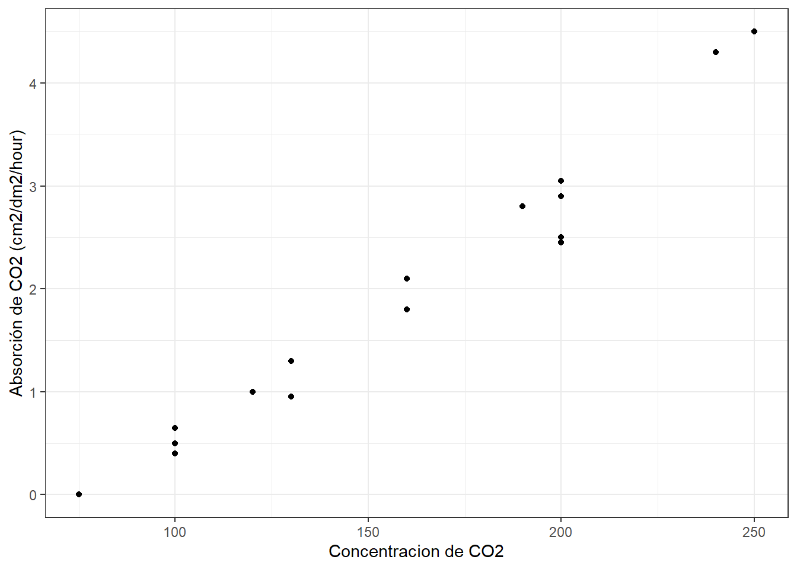

# Regresión lineal y correlación

Antes de comenzar con este práctico es importante tomarnos un tiempo para recordar que la estadística comienza con un problema, continúa con la toma de datos, sigue con la inspección y visualización de los datos y termina con el análisis de los mismos. Esto nos permitirá sacar conclusiones fundamentadas sobre nuestro problema inicial.

En el presente curso hemos establecido una receta de trabajo al momento de realizar inferencias estadísticas:

* **Paso 1:** Analizar nuestros datos a través de gráficos o tablas. El objetivo es evaluar posibles tendencias en nuestros datos.

* **Paso 2:** Definir la hipótesis que queremos poner a prueba. Debemos establecer la hipótesis nula y la(s) alternativa(s).

* **Paso 3:** Transformar la hipótesis en un modelo (prueba) estadístico. El modelo estará determinado por nuestras variables (importante diferenciar entre variables continuas y categóricas).

* **Paso 4:** Evaluar los supuestos del modelo. Es relevante para saber si podemos (o no) utilizar métodos paramétricos.

* **Paso 5:** Interpretar los resultados del modelo. Debemos evaluar el valor de probabilidad asociado a la prueba estadística.

## Modelos lineales generales

En muchas oportunidades estaremos interesados en saber como el comportamiento de una variable, o un conjunto de variables, impacta sobre otra. El objetivo es entender el grado de asociatividad y/o la posible relación funcional entre las variables.

Los modelos lineales generales describen una variable respuesta ($Y$) en términos de todos sus factores contribuyentes ($xβ$) en una combinación lineal, mientras que también incorpora el aporte de error ($\epsilon$).

$$
Y = \beta_0 + \beta_1x_1 + \epsilon 
$$

Esta clase de modelos estadísticos incluye la regresión lineal, regresión múltiple, ANOVA y ANCOVA.
 
En R, todos los análisis univariados (una variable respuesta) de este tipo se ajustan utilizando una única función lm(). 

El análisis de regresión lineal se usa para explicar o modelar la relación entre una variable continua $Y$, llamada variable respuesta o variable dependiente, y otra variable continua $x_1$, llamada variable explicativa o independiente. Cuando hay más de una variable continua explicativa ($X_1$, $X_2$,… $X_p$) el análisis se denomina regresión múltiple.

Si la variable explicativa es categórica en vez de continua,  entonces el análisis a realizar es un ANOVA (en inglés) o análisis de varianza de 1-vía. Cuando hay dos variables categóricas explicativas, el análisis se denomina análisis de varianza de 2-vías. 

Por ultimo, es posible que en un mismo análisis aparezcan variables explicativas tanto continuas como categóricas, y en este caso el análisis pasaría a denominarse análisis de covarianza o ANCOVA. 

## Correlación producto-momento de Pearson
Antes de comenzar la construcción de modelos lineales complejos, es importante observar la relación de datos para comprender cómo interactúan las diferentes variables. La **correlación producto-momento de Pearson** (para simplificarnos la vida hablaremos de correlación de Pearson) determina si existe asociación entre dos variables continuas. Dicho de otra forma, la correlación de Pearson analiza si dos variables continuas cambian de forma simultánea (están relacionadas).

El **coeficiente de correlación de Pearson (r)** es una medida de la fuerza de una asociación lineal entre dos variables continuas. El coeficiente de correlación de Pearson puede tomar un rango de valores de +1 a -1. Un valor de 0 indica que no hay asociación entre las dos variables. Un valor mayor que 0 indica una asociación positiva; es decir, a medida que aumenta el valor de una variable, también lo hace el valor de la otra variable. Un valor menor que 0 indica una asociación negativa; es decir, a medida que aumenta el valor de una variable, el valor de la otra variable disminuye.

Es importante destacar que la correlación de Pearson no tiene en cuenta si una variable se ha clasificado como una dependiente o independiente. Trata a todas las variables por igual. Incluso, las variables pueden estar medidas en diferentes unidades.

Empleamos la correlación de Pearson para determinar si dos variables cambian de forma independiente ($H_0$) o entonces, de forma alternativa, de forma conjunta ($H_1$). 


Para el laboratorio de Hoy ujtilizaremos el ejemplo 9.1 de Mead et al. (1993). El cual indica:

El siguiente experimento busca establecer la absorción de $CO_2$  de plantas de trigo en base a la concentración de este en el aire. Para esto se pasa aire con concentraciones variables de CO2 sobre plantas de trigo a una temperatura de 35 $°C$ y se mide la absorción de $CO_2$ por parte de las hojas de estas. Los valores de absorción ($y$) para diecisiete hojas, a diferentes concentraciones ($x$) se obtienen y son los datos que se encuentran en el archivo "trigo_co2.csv".


### Carguemos nuestros datos

```r
data <- read.csv2("./datos/trigo_co2.csv")
```


### Paso 1: Analicemos nuestros datos
Generemos un gráfico exploratorio de nuestras variables con ggplot:


```r
library(tidyverse)
```

```
## -- Attaching packages ----------------------------- tidyverse 1.2.1 --
```

```
## v ggplot2 3.3.1     v purrr   0.3.4
## v tibble  2.1.3     v dplyr   0.8.3
## v tidyr   1.1.0     v stringr 1.4.0
## v readr   1.3.1     v forcats 0.4.0
```

```
## Warning: package 'ggplot2' was built under R version 3.6.3
```

```
## Warning: package 'tidyr' was built under R version 3.6.3
```

```
## Warning: package 'purrr' was built under R version 3.6.3
```

```
## -- Conflicts -------------------------------- tidyverse_conflicts() --
## x dplyr::filter() masks stats::filter()
## x dplyr::lag()    masks stats::lag()
```

```r
ggplot(data, aes(x= Concentracion, y= Absorcion))+
        geom_point()+
        ylab("Absorción de CO2 (cm2/dm2/hour)")+
        xlab("Concentracion de CO2")+
        theme_bw ()
```




A simple vista se ve una estrecha relación (relación positiva) entre nuestros datos de concentracion de $CO_2$ en el aire y la absorción de este por las hojas de trigo.

### Paso 2: Definir la hipótesis que queremos poner a prueba. 

Nuestro interés es conocer si las variables Concentracion y Absorción cambian de forma simultánea (están relacionados). Para ello establecemos las siguientes hipótesis:

$$
H_0 = \text{Las variables Concentración y Absorción cambian de forma independiente} \\
H_A = \text{Las variables Concentración y Absorción cambian de forma conjunta}
$$

### Paso 3: Transformar la hipótesis en un modelo (prueba) estadístico. 
El siguiente paso involucra poner a prueba si existe relación estadísticamente significativa entre Concentración y Absorción. Para ello empleamos la **correlación de Pearson** para determinar si las dos variables cambian de forma independiente ($H_0$) o entonces, de forma alternativa, de forma conjunta ($H_A$).

### Paso 4: Evaluar los supuestos del modelo. 
R
ecordemos que todos los análisis paramétricos tienen supuestos sobre los datos subyacentes, y estos supuestos siempre deben confirmarse antes de utilizar estas pruebas. 

Existen dos supuestos principales subyacentes a la correlación producto-momento de Pearson:

* **Supuesto 1:** Los datos de cada una de las 2 variables siguen una distribución normal.

Veamos para la variable Concentración


```r
shapiro.test(data$Concentracion)
```

```
## 
## 	Shapiro-Wilk normality test
## 
## data:  data$Concentracion
## W = 0.94734, p-value = 0.4158
```

El valor de probabilidad (p>0.05) asociado a nuestro análisis sugiere que los datos de Concentración siguen una distribución normal

Veamos ahora para el caso de la variable Absorción


```r
shapiro.test(data$Absorcion)
```

```
## 
## 	Shapiro-Wilk normality test
## 
## data:  data$Absorcion
## W = 0.95391, p-value = 0.5212
```

El valor de probabilidad (p>0.05) asociado a nuestro análisis sugiere que los datos de la variable Absorción siguen una distribución normal.

* **Supuesto 2:** las observaciones representan una muestra aleatoria de la población y las observaciones son independientes entre sí.

### Paso 5: Interpretar los resultados del modelo. 

Ahora que hemos comprobado que los supuestos requeridos se cumplen, vamos a proceder a realizar la correlación de Pearson para nuestras variables de interés:


```r
cor.test(data$Concentracion, data$Absorcion, method = "pearson")
```

```
## 
## 	Pearson's product-moment correlation
## 
## data:  data$Concentracion and data$Absorcion
## t = 21.108, df = 15, p-value = 1.442e-12
## alternative hypothesis: true correlation is not equal to 0
## 95 percent confidence interval:
##  0.9538904 0.9942099
## sample estimates:
##       cor 
## 0.9835807
```

En el resultado anterior:

* `t`: es el valor estadístico de la prueba t (t = 21.108),

* `df`: son los grados de libertad (df = 15),

* `p-value`: es el nivel de significancia de la prueba t (p-value = 1.442e-12).

* Sample estimates: es el coeficiente de correlación (r = 0.9835).

Con este resultado, rechazamos la hipótesis de que estas dos variables varían de forma independiente y concluimos que hay una correlación entre las dos. Podemos describir este resultado de la siguiente forma: Hemos detectado una correlación entre la concentración de $CO_2$ en el aire y la absorción de este por las hojas de trigo ($r_15$ = 0.9835, P = 1.442e-12). 

## Regresión Lineal Simple 
Al igual que la correlación de Pearson, la regresión lineal explora la relación entre dos variables continuas. Mientras que la correlación analiza si dos variables continuas cambian de forma simultánea (están relacionadas), la regresión analiza la relación causal entre un predictor (variable independiente) y una variable de respuesta (dependiente). 

La función básica para construir un modelo lineal (como la regresión lineal) en R es usar la función `lm()`, la que proporciona una fórmula en forma de `y ~ x`. 

Trabajaremos con la misma información anterior. Recordemos que nunca debemos comenzar un análisis estadístico con una prueba estadística, siempre debemos comenzar con una figura de nuestros datos!!!

### Paso 1: Graficar nuestros datos. 
Ya que estamos trabajando con el mismo ejemplo anterior no es necesario volver a realizar el mismo gráfico anterior.

### Paso 2: Definir la hipótesis que queremos poner a prueba. 
Ahora si, el proceso cambia en compración con la correlación vista anteriormente.

Nuestro interés es conocer si concentración de $co_2$ en el aire predice la absorción de este por parte de las hojas de trigo. 

Para ello establecemos las siguientes hipótesis: 

$$
H_0 = \text{La pendiente de la asociación entre Concentración de CO2 y absorción es igual a cero} \\  
H_A = \text{La pendiente de la asociación entre Concentración de CO2 y absorción es diferente de cero}  
\\
o \\
β1  = 0 \\
β1\neq 0
$$

### Paso 3: Transformar la hipótesis en un modelo (prueba) estadístico. 

El siguiente paso involucra poner a prueba si la variación en Concentración de CO2 predice absorción de este por parte de la planta. Para ello ajustaremos un modelo de regresión lineal para determinar si las dos variables cambian de forma independiente (H0) o entonces, de forma alternativa, de forma conjunta (H1). 

Para ellos vamos a construir nuestro modelo de regresión lineal utilizando la función `lm()`:


```r
model1 <- lm(Absorcion ~ Concentracion, data = data)
model1
```

```
## 
## Call:
## lm(formula = Absorcion ~ Concentracion, data = data)
## 
## Coefficients:
##   (Intercept)  Concentracion  
##      -2.04267        0.02494
```

En el resultado anterior podemos ver los siguientes coeficientes:
* **Intercepto:** Valor predicho de la variable dependiente cuando la variable independiente es 0 
* **Pendiente:** Entrega el aumento predicho en la variable dependiente para un aumento unitario en X

Con estos resultados podríamos escribir la ecuación de esta linea 

$$
\hat{y} = -2.04267 + 0.02494\cdot\text{Concentracion}
$$

¿Cómo interpretaríamos el coeficiente $\beta_1$ (la pendiente)?

Para una unidad adicional en la concentración de CO2 en el aire esperaríamos ver un aumento de 0.025 unidades adicionales de absorción de co2 por parte de las hojas de las plantas de trigo.


### Paso 4: Evaluar los supuestos del modelo. 

La regresión lineal hace varias suposiciones sobre los datos, tales como:

* **Supuesto 1:** Linealidad de los datos.
Se asume que la relación entre el predictor (x) y el resultado (y) es lineal.

* **Supuesto 2:** Normalidad de los residuos.
Se asume que los errores residuales están normalmente distribuidos.

* **Supuesto 3:** Homogeneidad de la varianza de los residuos.
Se asume que los residuos tienen una variación constante (homoscedasticidad)

* **Supuesto 4:** Independencia de los términos de error de residuos.

Todos estos supuestos y posibles problemas pueden verificarse generando algunos gráficos de diagnóstico que visualizan los residuales. El gráfico de “residuos versus valores ajustados" es un diagrama de dispersión de los residuos en el eje “y” y los valores ajustados (respuestas estimadas) en el eje “x”. La gráfica se utiliza

para detectar la no linealidad, las variaciones de error desiguales y los valores atípicos (outliers).

Estas son las características de un buen gráfico de “residuos versus ajustes" y lo que sugieren sobre la idoneidad del modelo de regresión lineal simple:

a. Los residuos "se mueven al azar" alrededor de la línea 0. Esto sugiere que el supuesto de que la relación es lineal es razonable.

b. Los residuos forman aproximadamente una "banda horizontal" alrededor de la línea 0. Esto sugiere que las variaciones de los términos de error son iguales.

c. Ningún residuo "se destaca" del patrón aleatorio básico de residuos. Esto sugiere que no hay valores atípicos.

Entonces, generemos un gráfico “residuos versus valores ajustados” con nuestros datos. Para ello, debemos generar dos objetos que contengan los valores ajustados (valores predichos por el modelo) y los residuos (valor observado - valor ajustado) a partir de nuestro modelo:


```r
ajustados <- fitted(model1)

residuos <- residuals(model1)
```

Ahora, generamos un diagrama de dispersión y agregamos una línea de intercepto = 0 y pendiente = 0:


```r
plot(ajustados,residuos)
abline(0, 0)
```


En líneas generales, el análisis gráfico sugiere que nuestras variables tienden a cumplir con los supuestos establecidos para una regresión lineal. A modo de diagnostico podríamos decir que:

a. Los residuos "se mueven al azar" alrededor de la línea 0. 

b. Los residuos forman aproximadamente una "banda horizontal" alrededor de la línea 0. 

c. Existen algunos residuos  que  "se alejan" del patrón aleatorio básico de residuos. Esto sugiere que unos pocos valores atípicos.


### Paso 5: Interpretar los resultados del modelo. 

Usando la función summary () obtenemos toda la información sobre nuestro modelo: 


```r
summary(model1)
```

```
## 
## Call:
## lm(formula = Absorcion ~ Concentracion, data = data)
## 
## Residuals:
##      Min       1Q   Median       3Q      Max 
## -0.49631 -0.14851  0.04928  0.15149  0.35590 
## 
## Coefficients:
##                Estimate Std. Error t value Pr(>|t|)    
## (Intercept)   -2.042668   0.197917  -10.32 3.29e-08 ***
## Concentracion  0.024945   0.001182   21.11 1.44e-12 ***
## ---
## Signif. codes:  0 '***' 0.001 '**' 0.01 '*' 0.05 '.' 0.1 ' ' 1
## 
## Residual standard error: 0.2457 on 15 degrees of freedom
## Multiple R-squared:  0.9674,	Adjusted R-squared:  0.9653 
## F-statistic: 445.6 on 1 and 15 DF,  p-value: 1.442e-12
```

En el resultado anterior nos entrega la siguiente información:

* La fórmula del modelo: lm(formula = Absorcion ~ Concentracion)
* El valor del intercepto: Intercept = -2.042
* El valor de la pendiente: data$Concentración  = 0.0249 
*	df: son los grados de libertad (df = 5),
* p-value: es el nivel de significancia de la pendiente (p-value = 1.442e-12).
*	Coeficiente de determinación ($R^2$): Rendimiento general del modelo (R-squared = 0.9674). 

Con esta información podemos hacer inferencia para la regresión. Para esto debemos tener claro ciertos aspectos. Por ejemplo:

**¿Cuál es nuestro estadístico de Prueba? y ¿Cuál es el error estandar?**

Nuestro estadístico de prueba es el valor de t, (el cual es el estadístico de prueba utilizado como una aproximación de distribución cuando havemos inferencia para regresión) y su valor es 21.11. Nuestro error estandar es 0.001182

**¿Cuál es la conclusión general de nuestro test?**

Nuestro valor de probabilidad es 1.442e-12, lo que significa que que es altamente significativo, por lo cual rechazamos la hipotesis nula. 

**¿Como interpretamos esta conclusión general en el contexto de este experimento?**

Tenemos fuerte evidencia para sugeriri que existe relación entre la Concentración de CO2 en el aire y los niveles de CO2 absorvidos por la hoja de la planta de trigo

**¿Cuál es el valor de $R^2$?**

Dado que el coeficiente de determinación representa la cantidad de variación en la variable y explicada por la variable x, el 96\% de la variación en la Absorción de CO2 por parte de las hojas de trigo puede explicarse por la Concentración de CO2 en el aire.

Con base a los resultados, podemos concluir: De acuerdo a una regresión lineal, Abssorción de CO2 cambia con Concentración de CO2 en el aire de acuerdo a la siguiente función: 

$$
Absorcion = -2.042+0.0249\cdot\text{Concentración}  \\ 
(R^2 = 0.96, t_{(1,15)} = 21.11, p < 0.05). 
$$

Ahora podemos graficar los datos e incorporar la línea de regresión con geom_smooth (intercepto, pendiente):


```r
ggplot(data, aes(x=Concentracion, y=Absorcion))+
        geom_point()+
        geom_smooth(method="lm")+
        ylab("Absorción de CO2 (cm2/dm2/hour)")+
        xlab("Concentracion de CO2")+
        theme_bw() 
```

```
## `geom_smooth()` using formula 'y ~ x'
```


Finalmente, con estos datos podemos hacer estimaciones puntuales. Por ejemplo, El valor medio predicho de $\hat{y}$ para una concentración dada, digamos x = 150 es:


```r
-2.042 + 0.0249 * 150  
```

```
## [1] 1.693
```

El valor estimado de $\hat{y}$ para una sola hoja para la concentración, x = 150, es **1.693**.

Ahora, bien también podemos querer crear  una estimación de intervalo en lugar de una estimación puntual como la realizado anteriormente. Para hacer eso crearemos un intervalo de confianza para una media Y. Para esto utilizaremos la función `predict()` 


```r
predict(model1, 
        newdata = data.frame(Concentracion = 150), 
        interval = "confidence")
```

```
##        fit      lwr      upr
## 1 1.699064 1.569723 1.828406
```

Estoy 95\% seguro que la media de Absorción de CO2 de las hojas de trigo para aire con concentraciones de cO2  de 150 (cm2/dm2/hour) es entre 1.56 y 1.82 
